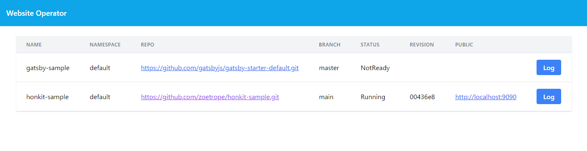

# website-operator

The WebSite Operator allows easy deployment of web sites generated by static site generators such as [HonKit](https://honkit.netlify.app), [MkDocs](https://www.mkdocs.org), [Gatsby](https://www.gatsbyjs.com) and so on.

## Installation

All resources (Namespace, CustomResourceDefinitions, Deployment and RBACs) are included in a single manifest file.
You can just install the manifest as follows:

```console
kubectl apply -f https://github.com/zoetrope/website-operator/releases/download/v0.2.2/install.yaml
```

## Usage

First, you need to prepare a repository of the content you want to deploy.

Here's some examples:

- [https://github.com/zoetrope/honkit-sample](https://github.com/zoetrope/honkit-sample)
- [https://github.com/zoetrope/gatsby-sample](https://github.com/zoetrope/gatsby-sample)

To deploy a site to a Kubernetes cluster you can use the following CustomResource:

```yaml
apiVersion: website.zoetrope.github.io/v1beta1
kind: WebSite
metadata:
  name: honkit-sample
  namespace: default
spec:
  buildImage: ghcr.io/zoetrope/node:12.19.0
  buildScript:
    rawData: |
        #!/bin/bash -ex
        cd $HOME
        rm -rf $REPO_NAME
        git clone $REPO_URL
        cd $REPO_NAME
        git checkout $REVISION
        npm install
        npm run build
        rm -rf $OUTPUT/*
        cp -r _book/* $OUTPUT/
  repoURL: https://github.com/zoetrope/honkit-sample.git
  branch: main
```

You can specify the following fields:

| Name                | Required | Description                                                                             |
| ------------------- | -------- | --------------------------------------------------------------------------------------- |
| buildImage          | `true`   | The name of container image to build your site                                          |
| buildScript         | `true`   | The script to build your site                                                           |
| repoURL             | `true`   | The URL of a repository that holds your site's content                                  |
| branch              | `true`   | The branch of the repository you want to deploy                                         |
| deployKeySecretName | `false`  | The name of a secret resource that holds a deploy key to access your private repository |
| extraResources      | `false`  | Any extra resources you want to deploy                                                  |
| replicas            | `false`  | The number of nginx instances                                                           |

In the build script, you have to copy your built output to `$OUTPUT` directory.

The following environment variables are available in the build script:

| Name      | Description                                  |
| --------- | -------------------------------------------- |
| HOME      | Working directory                            |
| REPO_NAME | The name of a repository                     |
| REPO_URL  | The URL of a repository                      |
| REVISION  | The revision of a repository you will deploy |
| OUTPUT    | The name of a directory to put your output   |

### Build Script as ConfigMap resource

You can also define a build script as ConfigMap resource.

Prepare a build script like bellow:

```bash
#!/bin/bash -ex
cd $HOME
rm -rf $REPO_NAME
git clone $REPO_URL
cd $REPO_NAME
git checkout $REVISION
npm install
npm run build
rm -rf $OUTPUT/*
cp -r _book/* $OUTPUT/
```

Create a ConfigMap resource in the same namespace as website-operator by the following command:

```console
kubectl create -n website-operator-system configmap build-scripts --from-file=/path/to/build.sh
```

You can specify `buildScript` field as follows:

```yaml
apiVersion: website.zoetrope.github.io/v1beta1
kind: WebSite
metadata:
  name: honkit-sample
  namespace: default
spec:
  buildImage: ghcr.io/zoetrope/node:12.19.0
  buildScript:
    configMap:
      name: build-scripts
      key: build.sh
  repoURL: https://github.com/zoetrope/honkit-sample.git
  branch: main
```

### Build Images

The following containers are provided to build your sites.

- [Ubuntu](https://github.com/users/zoetrope/packages/container/package/ubuntu)
- [Node](https://github.com/users/zoetrope/packages/container/package/node)
- [Python](https://github.com/users/zoetrope/packages/container/package/python)

If you want to customize a container image to generate your site, I recommend that you create a container image based on [Ubuntu](https://github.com/users/zoetrope/packages/container/package/ubuntu).

### Private Repository

You can use deploy key to deploy a content of your private repository.

Follow the page to generate keys and configure your repository:

[Managing deploy keys - GitHub Docs](https://docs.github.com/en/free-pro-team@latest/developers/overview/managing-deploy-keys)

Prepare a private key file (`id_rsa`) and `config` file like below:

```text
Host github.com
  HostName github.com
  User git
  UserKnownHostsFile /dev/null
  StrictHostKeyChecking no
```

Create a secret resource in the same namespace as WebSite resource by the following command:

```console
kubectl create -n default secret generic your-deploy-key --from-file=id_rsa=/path/to/.ssh/id_rsa --from-file=config=/path/to/.ssh/config
```

You can specify `deployKeySecretName` field as follows:

```yaml
apiVersion: website.zoetrope.github.io/v1beta1
kind: WebSite
metadata:
  name: mkdocs-sample
  namespace: default
spec:
  buildImage: ghcr.io/zoetrope/python:3.8.5
  buildScript:
    configMap:
      name: build-scripts
      key: build-mkdocs.sh
  repoURL: git@github.com:zoetrope/mkdocs-sample.git
  branch: main
  deployKeySecretName: your-deploy-key
```

### Extra Resource

You can deploy extra resources for your site.
For example, it is useful if you want to deploy [Contour](https://github.com/projectcontour/contour)'s HTTPProxy resource to expose your site to a load balancer.

Prepare a extra resource template in go's [text/template](https://golang.org/pkg/text/template/) format:

```gotemplate
apiVersion: projectcontour.io/v1
kind: HTTPProxy
metadata:
  name: {{.ResourceName}}
spec:
  virtualhost:
    fqdn: {{.ResourceName}}.{{.ResourceNamespace}}.example.com
  routes:
    - conditions:
        - prefix: /
      services:
        - name: {{.ResourceName}}
          port: 8080
```

In the template, you can use the following parameters:

| Name              | Description                           |
| ----------------- | ------------------------------------- |
| ResourceName      | The name of the WebSite resource      |
| ResourceNamespace | The namespace of the WebSite resource |

Create a ConfigMap resource in the same namespace as website-operator by the following command:

```console
kubectl create -n website-operator-system configmap your-templates --from-file=/path/to/httpproxy.tmpl
```

You can specify `extraResource` field as follows:

```yaml
apiVersion: website.zoetrope.github.io/v1beta1
kind: WebSite
metadata:
  name: honkit-sample
  namespace: default
spec:
  buildImage: ghcr.io/zoetrope/node:12.19.0
  buildScript:
    configMap:
      name: build-scripts
      key: build-honkit.sh
  repoURL: https://github.com/zoetrope/honkit-sample.git
  branch: main
  extraResources:
    - configMap:
        name: your-templates
        key: httpproxy.tmpl
```

Note: You need to add permission to website-operator to create extra resources.
For example, to create httpproxy resources, you have to add the following RBACs.

```yaml
apiVersion: rbac.authorization.k8s.io/v1
kind: ClusterRole
metadata:
  name: extra-resources-role
rules:
  - apiGroups:
      - projectcontour.io
    resources:
      - httpproxies
    verbs:
      - create
      - delete
      - get
      - list
      - patch
      - update
      - watch
  - apiGroups:
      - projectcontour.io
    resources:
      - httpproxies/status
    verbs:
      - get
---
apiVersion: rbac.authorization.k8s.io/v1
kind: ClusterRoleBinding
metadata:
  name: extra-resources-rolebinding
roleRef:
  apiGroup: rbac.authorization.k8s.io
  kind: ClusterRole
  name: extra-resources-role
subjects:
  - kind: ServiceAccount
    name: default
    namespace: website-operator-system
```

## Web UI

Web UI provides view of status and build log.


